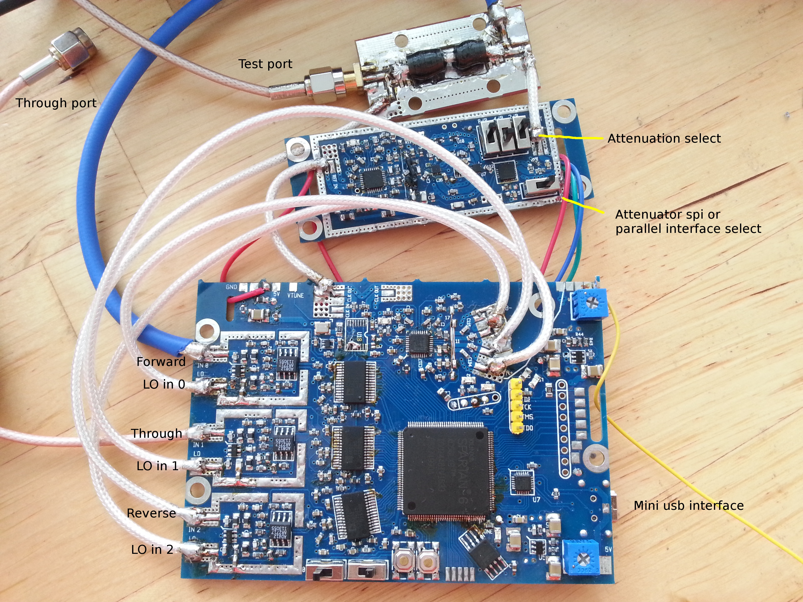
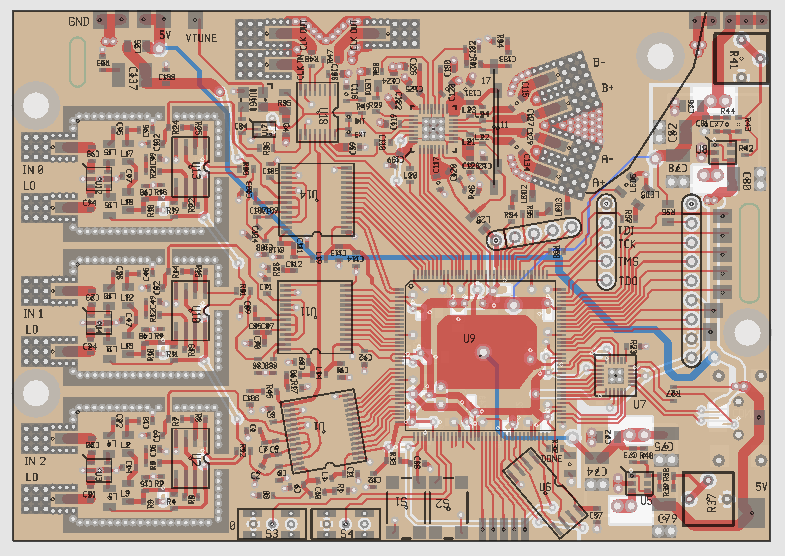
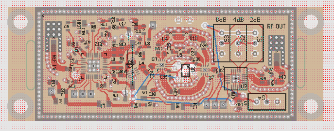
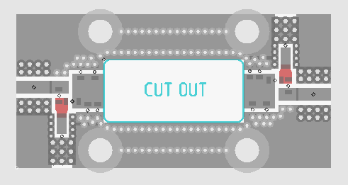
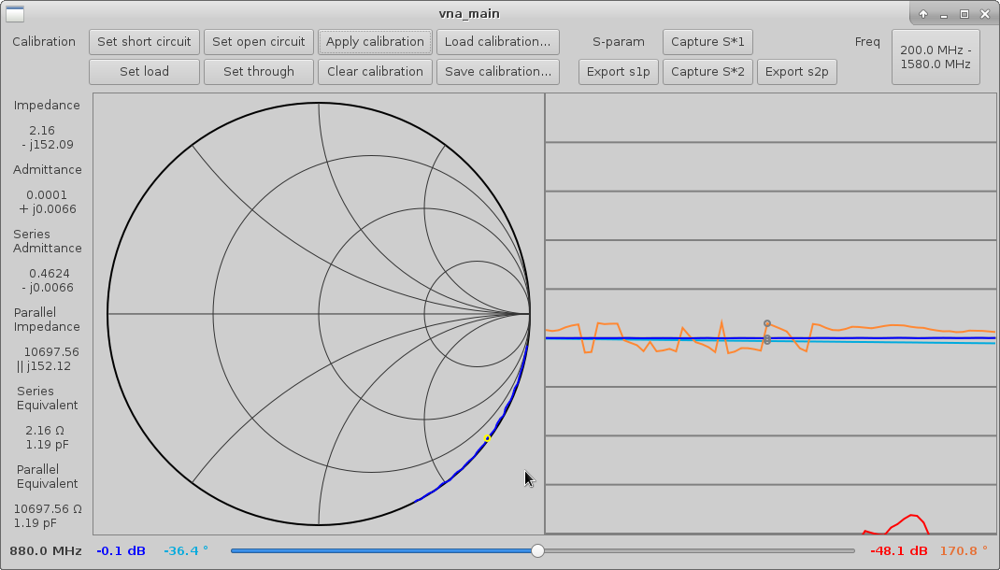
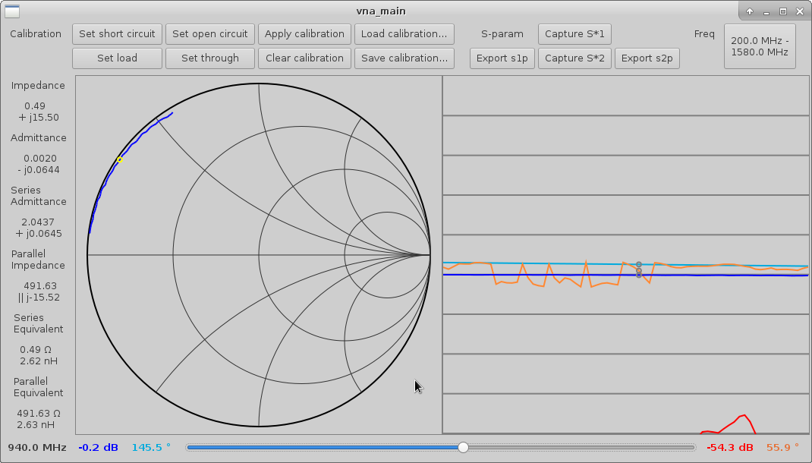
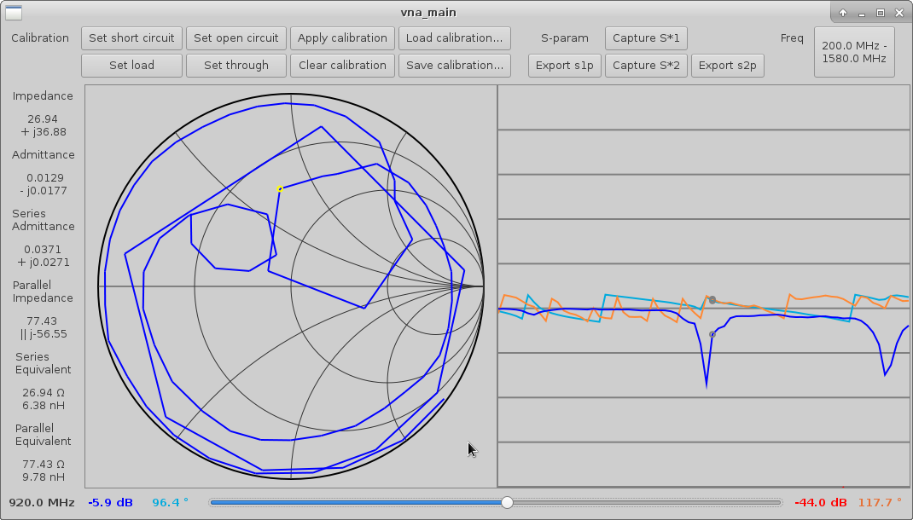

# vna
A simple and cheap vector network analyzer, including support software.

**Update:** A kickstarter has been launched to bring this project to production!
https://www.kickstarter.com/projects/1759352588/xavna-a-full-featured-low-cost-two-port-vna

The production version will be redesigned to fit onto a single PCB.

# Directory layout
* Root directory: software; compile and run on any Linux based system
* pcb: schematics, pcb layouts, and simulation files
* vhdl: circuitry implemented on the fpga

# Specifications
* Frequency range: guaranteed **137MHz - 2500MHz**, typical **135MHz - 3500MHz**
* Measurement signal level (controlled using on-board switches, iteration 1 board only): **-5dBm to 10dBm, with 2dB increments**
* Measurement signal level (controlled using spi interface): **-20dBm to 10dBm, with 1dB increments**
* 3 receivers: forward coupled, reverse coupled, through; can measure S11 and S21 of a two port device. To measure S22 and S12 the DUT needs to be manually reversed.

# Physical assembly
The iteration 1 VNA is composed of 3 separate boards:
* main: contains fpga, usb interface, receivers, clock generator, LO synthesizer
* tx: signal generator; contains synthesizer, amplifier, filter bank, and programmable attenuator
* coupler: resistive directional coupler, ~15dB coupling

The iteration 2 design is a single PCB.

# Interfacing
The main board connects to a PC through usb and communicates via a virtual serial port device; the PC software sets the frequency and other parameters by sending two-byte register write commands, and the device sends averaged vector values representing magnitude and phase of measured wave.

# Block diagram

##### Overall architecture

##### (iteration 1) Main board

##### (iteration 1) Signal generator

##### (iteration 1) FPGA logic

# Pictures (iteration 1)

##### Complete assembly

##### Calibration standards
(Short, Open, Load)

##### Main board

##### Signal generator

##### Directional coupler

# Screenshots

##### Open circuited stub

##### Short circuited stub

##### Antenna

# Parts selection
* fpga: XC6SLX9-2TQG144C 
* adc: AD9200
* mixer: CMY210
* synthesizers: ADF4350
* rf switches: BGS14GA14
* programmable attenuator: PE4302
