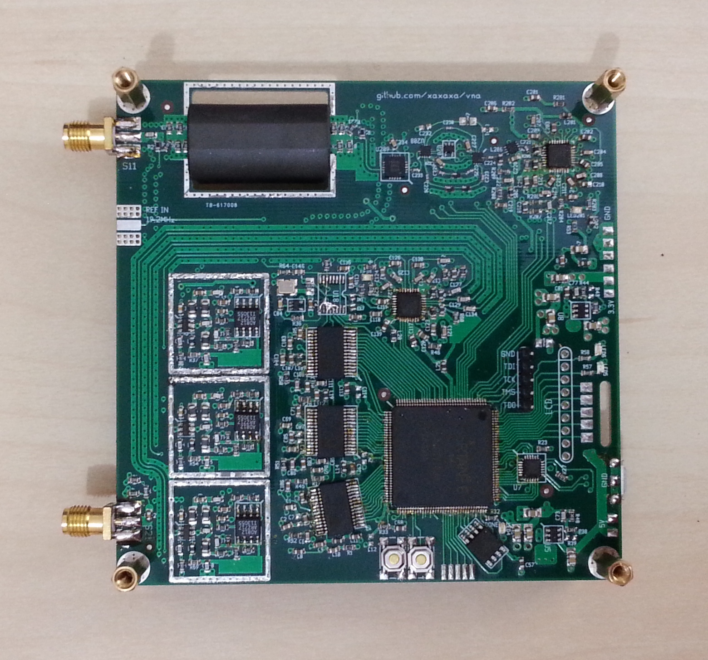
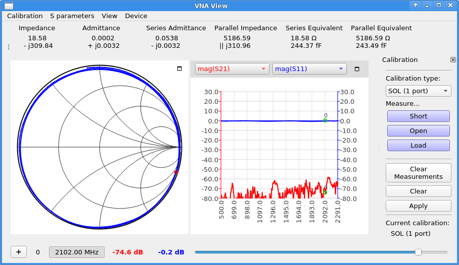
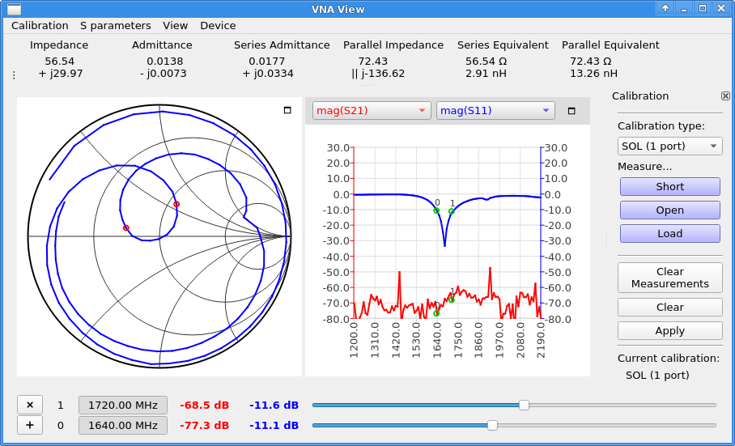
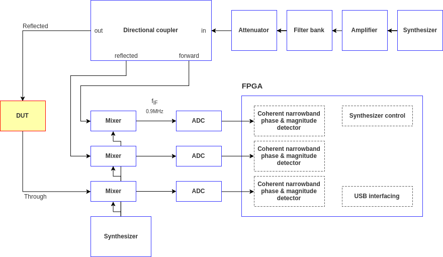
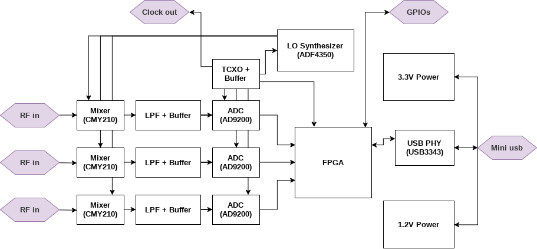
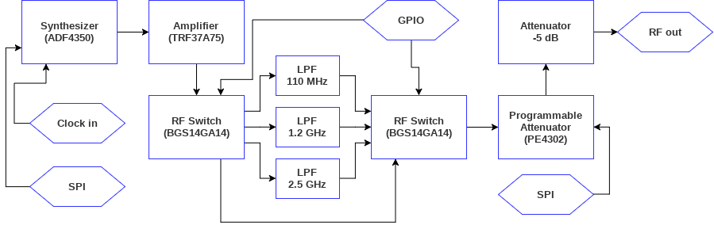
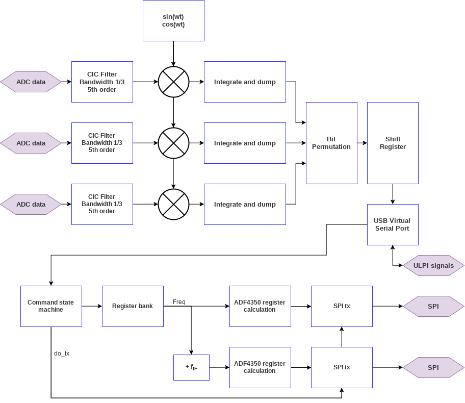

# vna
A simple and cheap vector network analyzer, including support software.

As seen on kickstarter:
https://www.kickstarter.com/projects/1759352588/xavna-a-full-featured-low-cost-two-port-vna

__Directory layout__

* libxavna: C & C++ library for accessing the hardware, see README.md in subdirectory for more info
* vna_qt: QT GUI
* pcb: schematics, pcb layouts, and simulation files
* vhdl: circuitry implemented on the fpga

__Specifications__

* Frequency range: guaranteed **137MHz - 2500MHz**, typical **135MHz - 3500MHz**
* Output signal level (configurable in software): **-20dBm to 10dBm, with 1dB increments**

__Interfacing__

* The main board connects to a PC through usb and communicates via a virtual serial port device; the PC software sets the frequency and other parameters by sending two-byte register write commands, and the device sends averaged vector values representing magnitude and phase of measured waves.

Table of Contents
=================
   * [Downloads](#downloads)
   * [Building the software](#building-the-software)
   * [Pictures](#pictures)
   * [Screenshots](#screenshots)
   * [Block diagram](#block-diagram)

# Downloads
For pre-compiled executables go to:
https://github.com/xaxaxa-dev/vna/releases

# Building the software

__Building on linux__

Build libxavna (required for QT GUI):
```bash
sudo apt-get install automake libtool make g++ libeigen3-dev libfftw3-dev
cd /PATH/TO/vna
autoreconf --install
./configure
make
cd libxavna/xavna_mock_ui/
/PATH/TO/qmake
make
```

Build & run QT GUI:
```bash
sudo apt-get install libqt5charts5-dev
cd /PATH/TO/vna
cd vna_qt
/PATH/TO/qmake
make
export QT=/PATH/TO/QT # e.g. ~/qt/5.10.1/gcc_64
../run
```

__Building on mac os__
```bash
brew install automake libtool make eigen fftw
cd /PATH/TO/vna
./deploy_macos.sh
# result is in ./vna_qt/vna_qt.app
```

__Cross-compile for windows (from linux)__

Download and build MXE:
```bash
cd ~/
git clone https://github.com/mxe/mxe.git
cd mxe
export QT_MXE_ARCH=386
make qt5 qtcharts cc eigen fftw pthreads
```
Edit mxe/settings.mk and add i686-w64-mingw32.shared to MXE_TARGETS.

Build
```bash
cd /PATH/TO/vna
export PATH="/PATH/TO/MXE/usr/bin:$PATH"
./deploy_windows.sh
```


# Pictures
##### Main board (release 2)


##### Calibration standards (Short, Open, Load)


# Screenshots

##### Open circuited coax stub



##### Antenna



##### Time to fault (measuring coax cable)


# Block diagram

##### Overall architecture


##### Receivers & interfacing


##### Signal generator


##### FPGA logic


##### Parts selection

*T/R version*
* fpga: XC6SLX9-2TQG144C 
* adc: AD9200
* mixer: AD8342
* synthesizers: ADF4350
* rf switches: BGS14GA14
* programmable attenuator: PE4312

*Full two port version*
* fpga: XC6SLX9-2TQG144C 
* adc: ADC10080
* adc driver: ADA4932-1
* mixer: AD8342
* synthesizers: ADF4351
* rf switches: RFSW6024, BGS12PL6
* programmable attenuator: PE4312

